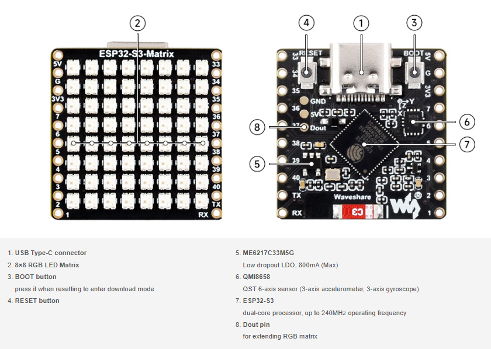
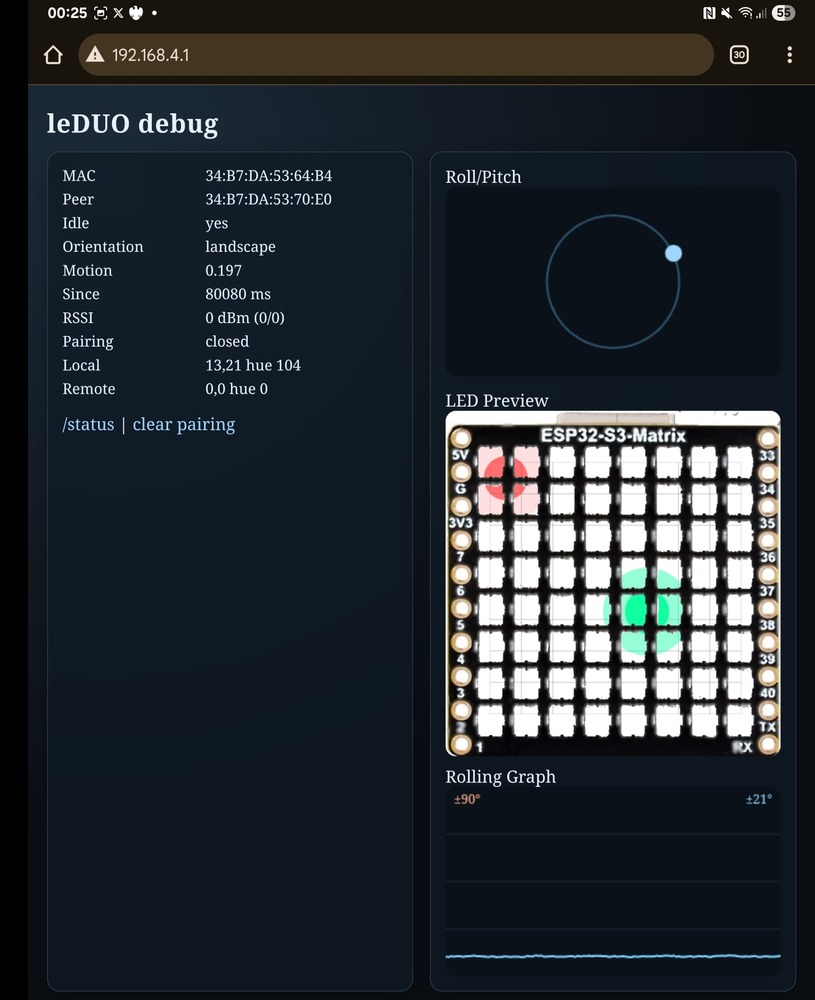

z# LEDDuo

This is a gratuitous use of Codex to do something fun with some ESP32-S3 dev boards that have been getting dusty.

The code is targeting the [Waveshare ESP32-S3-Matrix](https://www.waveshare.com/wiki/ESP32-S3-Matrix), which is an ESP32-S3, IMU, and 64 RGB LEDs, in an 8x8 grid. Neat!



* Draws an interactive sprite/tail on the 8 x 8 LED matrix, controlled by the IMU / board tilt & roll.
* Also, should auto-pair with a 2nd board running the same code.
* The boards will broadcast and receive each other's LED data, and render both trails
* There is some basic "collision" event logic that should be broadcast/synced. 
* There's an auto-ranging RSSI function that averages each other's measured RSSI, scaled to an initial 5s averaging at pairing
* the RSSI is used to scale the remote/guest brightness of the led sprite on the local screen
* the sprites will just kinda wander about if they get bored (idle time = DVD screensaver)
* if a remote board is bored, the locally rendered view of it's data will be dimmed, but still shown.
* there's also a dashboard, using websockets, on a co-hosted AP 
* dashboard draws motion (pitch/roll) on a dual axis auto-ranging graph
* dashboard also renders the LED matrix of the AP you are connected to. 
* dashboard also renders the guest LED data of the AP you are connected to.
* fancy alpha masked image of the devboard is overlaid onto the LED matrix view. 

I think that's about it...

Oh, yeah, there's a Debug output to help you get a feel for tuning all the parameters (in ./config.h)

## Example Output

Here is the example of ESPNOW receiving device console output, and moving from idle to active modes, due to movement.

```
I (741316) imu_led: imu ax=1451 ay=1709 az=-3874 gx=1854 gy=2885 gz=-496 motion=0.175 idle=1 since=17119ms rssi=0 norm=1.00 glow=90.0
I (741816) imu_led: imu ax=1437 ay=1711 az=-3853 gx=1705 gy=3376 gz=-379 motion=0.182 idle=1 since=17620ms rssi=0 norm=1.00 glow=90.0
I (742336) imu_led: imu ax=1429 ay=1697 az=-3863 gx=1491 gy=3093 gz=-373 motion=0.165 idle=1 since=18139ms rssi=0 norm=1.00 glow=90.0
I (742836) imu_led: imu ax=1704 ay=2717 az=-3968 gx=2550 gy=32767 gz=-14336 motion=1.655 idle=0 since=0ms rssi=0 norm=1.00 glow=90.0
I (743356) imu_led: imu ax=1570 ay=207 az=-2703 gx=-27582 gy=32767 gz=-32768 motion=3.104 idle=0 since=0ms rssi=0 norm=1.00 glow=90.0
I (743856) imu_led: imu ax=2924 ay=-10783 az=-5635 gx=-10948 gy=32767 gz=32767 motion=2.549 idle=0 since=0ms rssi=0 norm=1.00 glow=90.0
I (744376) imu_led: imu ax=1688 ay=-7706 az=-4662 gx=-21142 gy=14239 gz=32767 motion=2.272 idle=0 since=0ms rssi=0 norm=1.00 glow=90.0
I (744896) imu_led: imu ax=1729 ay=2140 az=-3487 gx=-2597 gy=5876 gz=218 motion=0.290 idle=0 since=59ms rssi=0 norm=1.00 glow=90.0
I (745396) imu_led: imu ax=1769 ay=2110 az=-3527 gx=1451 gy=3336 gz=-357 motion=0.171 idle=0 since=560ms rssi=0 norm=1.00 glow=90.0

```


